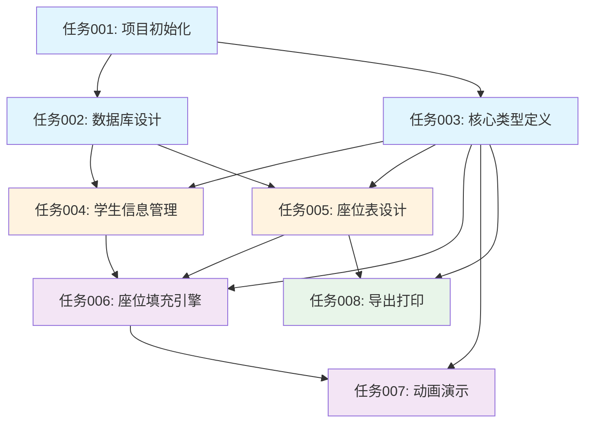

# 智能换座位系统 - 开发任务总览

## 一、项目信息

**项目名称**：智能换座位系统
**技术栈**：Tauri + Vue 3 + TypeScript + Vuetify + SQLite
**创建日期**：2025-12-27
**文档版本**：v1.0

## 二、任务清单

### 任务 001: 项目初始化与脚手架搭建
- **文件**: [001-项目初始化任务.md](./tasks/001-项目初始化任务.md)
- **优先级**: P0
- **预估工作量**: 2-3小时
- **状态**: 待开始
- **负责人**: 待分配

### 任务 002: 数据库设计与实现
- **文件**: [002-数据库设计任务.md](./tasks/002-数据库设计任务.md)
- **优先级**: P0
- **预估工作量**: 3-4小时
- **状态**: 待开始
- **负责人**: 待分配
- **依赖**: 任务 001

### 任务 003: 核心类型定义
- **文件**: [003-核心类型定义任务.md](./tasks/003-核心类型定义任务.md)
- **优先级**: P0
- **预估工作量**: 2-3小时
- **状态**: 待开始
- **负责人**: 待分配
- **依赖**: 任务 001

### 任务 004: 学生信息管理模块
- **文件**: [004-学生信息管理模块.md](./tasks/004-学生信息管理模块.md)
- **优先级**: P0
- **预估工作量**: 6-8小时
- **状态**: 待开始
- **负责人**: 待分配
- **依赖**: 任务 002, 任务 003

### 任务 005: 座位表设计模块
- **文件**: [005-座位表设计模块.md](./tasks/005-座位表设计模块.md)
- **优先级**: P0
- **预估工作量**: 8-10小时
- **状态**: 待开始
- **负责人**: 待分配
- **依赖**: 任务 002, 任务 003

### 任务 006: 座位填充引擎
- **文件**: [006-座位填充引擎.md](./tasks/006-座位填充引擎.md)
- **优先级**: P0
- **预估工作量**: 10-12小时
- **状态**: 待开始
- **负责人**: 待分配
- **依赖**: 任务 003, 任务 004, 任务 005

### 任务 007: 动画演示模块
- **文件**: [007-动画演示模块.md](./tasks/007-动画演示模块.md)
- **优先级**: P0
- **预估工作量**: 8-10小时
- **状态**: 待开始
- **负责人**: 待分配
- **依赖**: 任务 003, 任务 006

### 任务 008: 导出打印模块
- **文件**: [008-导出打印模块.md](./tasks/008-导出打印模块.md)
- **优先级**: P1
- **预估工作量**: 4-6小时
- **状态**: 待开始
- **负责人**: 待分配
- **依赖**: 任务 003, 任务 005

## 三、任务依赖关系图



## 四、执行顺序建议

### 第一阶段：基础建设（1-2天）
按顺序完成：
1. **任务 001**: 项目初始化与脚手架搭建
2. **任务 002**: 数据库设计与实现
3. **任务 003**: 核心类型定义

**里程碑**: 开发环境搭建完成，可以开始业务开发

### 第二阶段：核心功能（3-4天）
并行开发（任务 004 和 005 可同时进行）：
4. **任务 004**: 学生信息管理模块
5. **任务 005**: 座位表设计模块

**里程碑**: 基本的数据管理和座位表设计功能完成

### 第三阶段：核心算法（2-3天）
6. **任务 006**: 座位填充引擎

**里程碑**: 核心填充算法实现，可以进行座位分配

### 第四阶段：增强功能（2-3天）
7. **任务 007**: 动画演示模块
8. **任务 008**: 导出打印模块

**里程碑**: 所有核心功能完成，可以发布 MVP 版本

## 五、预估总工作量

| 阶段 | 任务数 | 预估工时 |
|------|--------|----------|
| 基础建设 | 3 | 7-10小时 |
| 核心功能 | 2 | 14-18小时 |
| 核心算法 | 1 | 10-12小时 |
| 增强功能 | 2 | 12-16小时 |
| **总计** | **8** | **43-56小时** |

**预计开发周期**: 8-14个工作日（假设每天工作 4-6 小时）

## 六、文件结构总览

完成任务后，项目应包含以下文件结构：

```
deskmeta-management/
├── wiki/                           # 文档目录
│   ├── PRD.md                      # 产品需求文档
│   ├── SDD.md                      # 系统设计文档
│   ├── 用户需求.md                 # 用户需求
│   └── 系统架构图.md               # 系统架构图
│
├── docs/                           # 开发文档
│   ├── 任务总览.md                 # 本文件
│   └── tasks/                      # 任务文档
│       ├── 001-项目初始化任务.md
│       ├── 002-数据库设计任务.md
│       ├── 003-核心类型定义任务.md
│       ├── 004-学生信息管理模块.md
│       ├── 005-座位表设计模块.md
│       ├── 006-座位填充引擎.md
│       ├── 007-动画演示模块.md
│       └── 008-导出打印模块.md
│
├── src/                            # 源代码
│   ├── core/                       # 核心业务逻辑
│   │   ├── seat-manager.ts
│   │   ├── student-manager.ts
│   │   ├── fill-strategies.ts
│   │   ├── constraint-engine.ts
│   │   └── animation-engine.ts
│   │
│   ├── ui/                         # UI 层
│   │   ├── components/             # 通用组件
│   │   │   ├── layout-designer/
│   │   │   ├── student-list/
│   │   │   ├── fill-controls/
│   │   │   └── animation-player/
│   │   └── views/                  # 页面视图
│   │
│   ├── stores/                     # Pinia 状态管理
│   │   ├── layout.ts
│   │   ├── student.ts
│   │   ├── fill.ts
│   │   └── animation.ts
│   │
│   ├── repository/                 # 数据访问层
│   │   ├── base-repository.ts
│   │   ├── student.repository.ts
│   │   ├── layout.repository.ts
│   │   └── seating-record.repository.ts
│   │
│   ├── database/                   # 数据库
│   │   ├── connection.ts
│   │   ├── migrations/
│   │   │   ├── 001_initial.sql
│   │   │   └── 002_add_indexes.sql
│   │   └── seeds/
│   │
│   ├── types/                      # TypeScript 类型
│   │   ├── index.ts
│   │   ├── common.ts
│   │   ├── student.ts
│   │   ├── layout.ts
│   │   ├── fill.ts
│   │   ├── animation.ts
│   │   └── api.ts
│   │
│   ├── utils/                      # 工具函数
│   │   ├── validators.ts
│   │   ├── exporters.ts
│   │   └── helpers.ts
│   │
│   ├── plugins/                    # Vue 插件
│   │   └── vuetify.ts
│   │
│   ├── router/                     # 路由
│   │   └── index.ts
│   │
│   ├── App.vue
│   └── main.ts
│
├── src-tauri/                      # Tauri 后端
│   ├── src/
│   │   └── main.rs
│   ├── Cargo.toml
│   └── tauri.conf.json
│
├── package.json
├── tsconfig.json
├── vite.config.ts
└── README.md
```

## 七、开发建议

### 7.1 使用 Claude 执行任务

当你需要让 Claude 执行某个任务时，可以这样引用：

```
请按照 docs/tasks/001-项目初始化任务.md 中的步骤，完成项目初始化
```

或者：

```
请实现任务 004: 学生信息管理模块
参考文档：docs/tasks/004-学生信息管理模块.md
```

### 7.2 任务执行检查清单

每个任务完成后，请检查：
- [ ] 所有验收标准已满足
- [ ] 代码已提交到 Git
- [ ] 相关文档已更新
- [ ] 功能已测试通过
- [ ] 无编译错误和警告

### 7.3 常用命令

```bash
# 启动开发环境
npm run tauri dev

# 构建生产版本
npm run tauri build

# 运行测试
npm test

# 代码检查
npm run lint

# 类型检查
npm run type-check
```

## 八、文档维护

### 8.1 更新任务状态

当任务完成时，请更新对应的任务文档中的"任务状态"字段。

### 8.2 添加新任务

如果需要添加新任务，请：
1. 创建新的任务文档（遵循现有格式）
2. 更新本文档的任务清单
3. 更新依赖关系图
4. 重新评估总工作量

### 8.3 问题反馈

如果在执行任务时遇到问题，请：
1. 在任务文档中记录问题和解决方案
2. 更新"风险与注意事项"章节
3. 必要时更新 PRD 或 SDD 文档

## 九、参考文档

- [PRD - 产品需求文档](../wiki/PRD.md)
- [SDD - 系统设计文档](../wiki/SDD.md)
- [系统架构图](../wiki/系统架构图.md)
- [用户需求](../wiki/用户需求.md)

## 十、附录

### 10.1 技术栈官方文档

- [Tauri 文档](https://tauri.app/v1/guides/)
- [Vue 3 文档](https://cn.vuejs.org/)
- [Vuetify 3 文档](https://vuetifyjs.com/)
- [Pinia 文档](https://pinia.vuejs.org/)
- [TypeScript 文档](https://www.typescriptlang.org/)
- [SQLite 文档](https://www.sqlite.org/docs.html)

### 10.2 开发工具推荐

- **IDE**: Visual Studio Code
- **Git 客户端**: GitKraken / SourceTree
- **API 测试**: Postman
- **数据库管理**: DB Browser for SQLite

---

**文档维护者**: Claude
**最后更新**: 2025-12-27
**文档状态**: 已完成
