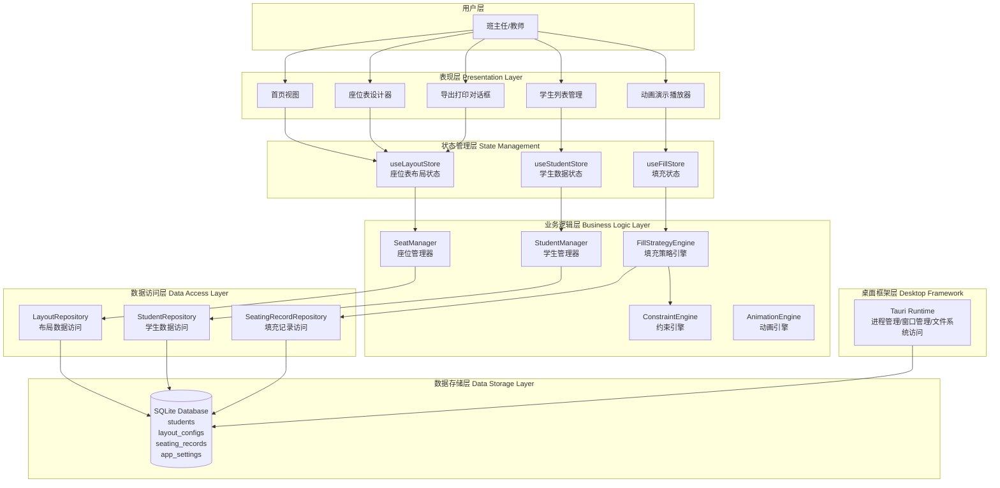
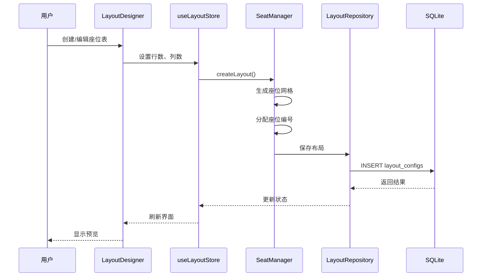
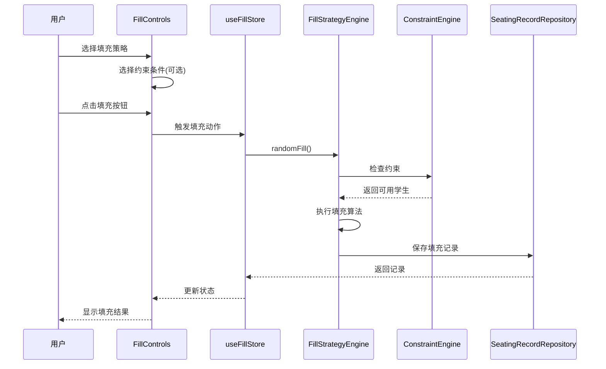
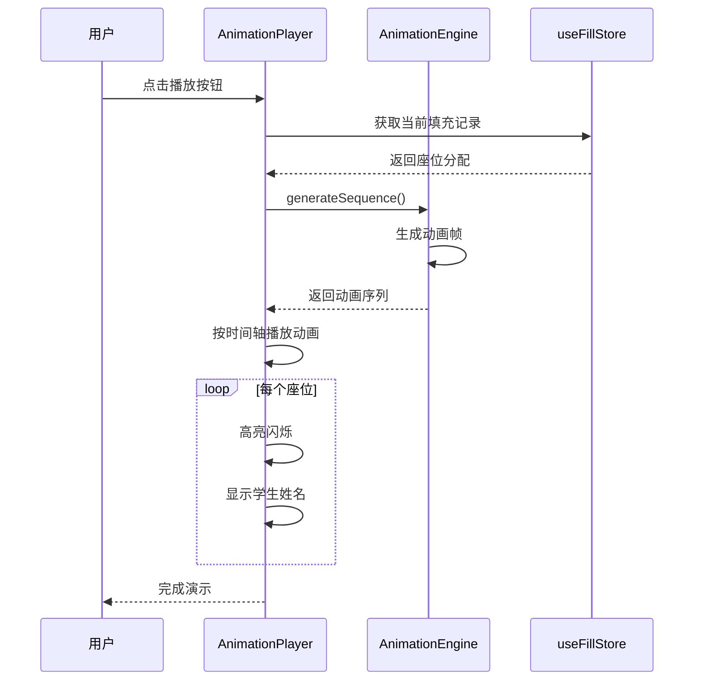
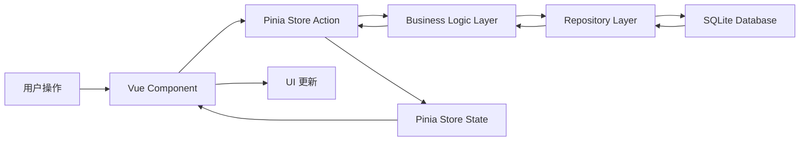

# 智能换座位系统 - 系统整体架构图

## 一、系统全景架构



## 二、分层架构详解

### 2.1 表现层（Presentation Layer）

**职责**：用户界面渲染、用户交互、数据展示

**核心视图**：
- **Home.vue** - 应用主入口，导航到各功能模块
- **LayoutDesigner.vue** - 座位表设计主界面
- **StudentManagement.vue** - 学生信息管理界面
- **AnimationView.vue** - 动画演示界面
- **ExportPreview.vue** - 导出预览界面

**核心组件库**：
```
src/renderer/src/ui/components/
├── layout-designer/          # 座位表设计器组件
│   ├── SeatingGrid.vue      # 座位网格
│   ├── FunctionalAreas.vue  # 功能区域标注
│   ├── SeatEditor.vue       # 座位编辑器
│   └── NumberingSelector.vue # 编号模式选择器
├── student-list/            # 学生列表组件
│   ├── StudentTable.vue     # 学生表格
│   ├── StudentForm.vue      # 学生表单
│   └── ImportDialog.vue     # 导入对话框
├── fill-controls/           # 填充控制组件
│   ├── StrategySelector.vue # 策略选择器
│   ├── ConstraintSelector.vue # 约束选择器
│   └── FillButton.vue       # 填充按钮
└── animation-player/        # 动画播放器组件
    ├── AnimationCanvas.vue  # 动画画布
    ├── ControlPanel.vue     # 控制面板
    └── ProgressIndicator.vue # 进度指示器
```

### 2.2 状态管理层（State Management Layer）

**职责**：全局状态管理、组件间通信、状态持久化

**Pinia Store 架构**：

```typescript
// useLayoutStore - 座位表布局状态
interface LayoutState {
  currentLayout: LayoutConfig | null;
  layouts: LayoutConfig[];
  selectedSeats: string[];
  functionalAreas: FunctionalAreas;
}

// useStudentStore - 学生数据状态
interface StudentState {
  students: Student[];
  selectedStudents: string[];
  loading: boolean;
  filters: StudentFilters;
}

// useFillStore - 填充状态
interface FillState {
  currentRecord: SeatingRecord | null;
  history: SeatingRecord[];
  isAnimating: boolean;
  animationConfig: AnimationConfig;
}
```

### 2.3 业务逻辑层（Business Logic Layer）

**职责**：核心业务逻辑实现、算法封装、规则引擎

#### SeatManager - 座位管理器
```typescript
class SeatManager {
  // 创建布局
  createLayout(config: LayoutConfig): LayoutConfig

  // 验证布局
  validateLayout(layout: LayoutConfig): ValidationResult

  // 生成座位编号
  generateSeatNumbers(layout: LayoutConfig): LayoutConfig

  // 获取容量
  getCapacity(layout: LayoutConfig): number

  // 查找座位
  findSeat(layout: LayoutConfig, row: number, col: number): Seat | null
}
```

#### StudentManager - 学生管理器
```typescript
class StudentManager {
  // 添加学生
  addStudent(student: Omit<Student, 'id'>): Student

  // 批量导入
  importStudents(data: ImportData[]): ImportResult

  // 验证学生
  validateStudent(data: any): ValidationResult

  // 检查姓名唯一性
  isNameUnique(name: string): boolean
}
```

#### FillStrategyEngine - 填充策略引擎
```typescript
class FillStrategyEngine {
  // 随机填充
  randomFill(layout: LayoutConfig, students: Student[], options?: FillOptions): SeatingRecord

  // 手动填充
  manualFill(layout: LayoutConfig, assignments: Map<string, string>): SeatingRecord

  // 混合填充
  mixedFill(layout: LayoutConfig, students: Student[], fixedAssignments: Map<string, string>): SeatingRecord

  // 验证填充结果
  validate(assignments: SeatAssignment[]): ValidationResult
}
```

#### ConstraintEngine - 约束引擎
```typescript
class ConstraintEngine {
  // 应用约束
  applyConstraints(layout: LayoutConfig, students: Student[], type: ConstraintType): ConstraintResult

  // 检查约束
  checkConstraints(assignments: SeatAssignment[], students: Student[], type: ConstraintType): boolean

  // 获取违规信息
  getViolations(assignments: SeatAssignment[], students: Student[], type: ConstraintType): Violation[]
}
```

#### AnimationEngine - 动画引擎
```typescript
class AnimationEngine {
  // 生成动画序列
  generateSequence(assignments: SeatAssignment[], students: Map<string, Student>): AnimationFrame[]

  // 播放动画
  play(frames: AnimationFrame[], config: AnimationConfig): Promise<void>

  // 暂停动画
  pause(): void

  // 继续动画
  resume(): void

  // 停止动画
  stop(): void
}
```

### 2.4 数据访问层（Data Access Layer）

**职责**：数据持久化、CRUD操作、事务管理

**Repository 模式实现**：

```typescript
// BaseRepository - 基础仓储
abstract class BaseRepository<T> {
  protected db: Database
  abstract findById(id: string): T | null
  abstract findAll(): T[]
  abstract insert(entity: Omit<T, 'id'>): T
  abstract update(id: string, entity: Partial<T>): boolean
  abstract delete(id: string): boolean
  protected generateId(): string
}

// StudentRepository - 学生仓储
class StudentRepository extends BaseRepository<Student> {
  findByName(name: string): Student | null
  findByGender(gender: 'male' | 'female'): Student[]
  import(students: Student[]): number
}

// LayoutRepository - 布局仓储
class LayoutRepository extends BaseRepository<LayoutConfig> {
  findDefault(): LayoutConfig | null
  setDefault(id: string): void
}

// SeatingRecordRepository - 填充记录仓储
class SeatingRecordRepository extends BaseRepository<SeatingRecord> {
  findByLayoutId(layoutId: string): SeatingRecord[]
  findRecent(limit: number): SeatingRecord[]
}
```

### 2.5 数据存储层（Data Storage Layer）

**数据库结构**：

```sql
students (学生表)
├── id (TEXT PRIMARY KEY)
├── name (TEXT UNIQUE NOT NULL)
├── gender (TEXT NOT NULL)
├── contact (TEXT)
├── grade (TEXT)
├── class_name (TEXT)
├── special_needs (INTEGER)
├── preferred_seat_id (TEXT)
├── notes (TEXT)
└── created_at, updated_at (TIMESTAMP)

layout_configs (布局配置表)
├── id (TEXT PRIMARY KEY)
├── name (TEXT NOT NULL)
├── rows (INTEGER NOT NULL)
├── cols (INTEGER NOT NULL)
├── seat_numbering_mode (TEXT NOT NULL)
├── layout_data (TEXT NOT NULL) -- JSON
├── functional_areas (TEXT) -- JSON
├── is_default (INTEGER)
└── created_at, updated_at (TIMESTAMP)

seating_records (填充记录表)
├── id (TEXT PRIMARY KEY)
├── layout_id (TEXT NOT NULL)
├── fill_strategy (TEXT NOT NULL)
├── constraint_type (TEXT)
├── seating_data (TEXT NOT NULL) -- JSON
└── created_at (TIMESTAMP)

app_settings (系统配置表)
├── key (TEXT PRIMARY KEY)
├── value (TEXT NOT NULL) -- JSON
└── updated_at (TIMESTAMP)
```

## 三、核心业务流程

### 3.1 座位表设计流程



### 3.2 学生填充流程



### 3.3 动画演示流程



## 四、技术架构图

### 4.1 技术栈层次

```
┌─────────────────────────────────────────────────────────────┐
│                    Desktop Application                       │
│                     (Tauri + Vue 3)                          │
└─────────────────────────────────────────────────────────────┘
                              ↓
┌─────────────────────────────────────────────────────────────┐
│                      Frontend Layer                          │
│  ┌─────────────────────────────────────────────────────┐    │
│  │  Vue 3 (Composition API + TypeScript)              │    │
│  │  ├─ Vuetify (Material Design UI Components)        │    │
│  │  ├─ Pinia (State Management)                       │    │
│  │  ├─ Vue Router (Navigation)                        │    │
│  │  ├─ GSAP (Animation Library)                       │    │
│  │  ├─ jsPDF (PDF Generation)                         │    │
│  │  └─ html2canvas (Canvas Export)                    │    │
│  └─────────────────────────────────────────────────────┘    │
└─────────────────────────────────────────────────────────────┘
                              ↓
┌─────────────────────────────────────────────────────────────┐
│                      Backend Layer                           │
│  ┌─────────────────────────────────────────────────────┐    │
│  │  Tauri Runtime (Rust)                               │    │
│  │  ├─ Window Management                               │    │
│  │  ├─ File System Access                              │    │
│  │  ├─ Inter-Process Communication                     │    │
│  │  └─ Command Registration                            │    │
│  └─────────────────────────────────────────────────────┘    │
└─────────────────────────────────────────────────────────────┘
                              ↓
┌─────────────────────────────────────────────────────────────┐
│                      Data Layer                              │
│  ┌─────────────────────────────────────────────────────┐    │
│  │  SQLite (better-sqlite3)                            │    │
│  │  ├─ Database Connection Pool                        │    │
│  │  ├─ WAL Mode (Write-Ahead Logging)                  │    │
│  │  ├─ Transaction Management                          │    │
│  │  └─ Query Optimization                              │    │
│  └─────────────────────────────────────────────────────┘    │
└─────────────────────────────────────────────────────────────┘
```

### 4.2 文件系统架构

```
deskmeta-management/
├── src-tauri/                      # Tauri 后端（Rust）
│   ├── src/
│   │   ├── main.rs                # Rust 主入口
│   │   ├── commands/              # Tauri 命令定义
│   │   └── lib.rs                 # Rust 库文件
│   ├── Cargo.toml                 # Rust 依赖配置
│   ├── tauri.conf.json            # Tauri 配置
│   └── build.rs                   # 构建脚本
│
├── src/                           # Vue 前端
│   ├── core/                      # 核心业务逻辑
│   │   ├── seat-manager.ts
│   │   ├── student-manager.ts
│   │   ├── fill-strategies.ts
│   │   ├── constraint-engine.ts
│   │   └── animation-engine.ts
│   │
│   ├── ui/                        # UI 层
│   │   ├── components/            # 通用组件
│   │   │   ├── layout-designer/
│   │   │   ├── student-list/
│   │   │   ├── fill-controls/
│   │   │   └── animation-player/
│   │   └── views/                 # 页面视图
│   │       ├── Home.vue
│   │       ├── LayoutDesigner.vue
│   │       ├── StudentManagement.vue
│   │       └── AnimationView.vue
│   │
│   ├── stores/                    # Pinia 状态管理
│   │   ├── layout.ts
│   │   ├── student.ts
│   │   └── fill.ts
│   │
│   ├── repository/                # 数据访问层
│   │   ├── base-repository.ts
│   │   ├── student.repository.ts
│   │   ├── layout.repository.ts
│   │   └── seating-record.repository.ts
│   │
│   ├── database/                  # 数据库层
│   │   ├── connection.ts          # 数据库连接
│   │   ├── migrations/            # 数据库迁移
│   │   │   ├── 001_initial.sql
│   │   │   └── 002_add_indexes.sql
│   │   └── seeds/                 # 种子数据
│   │
│   ├── types/                     # TypeScript 类型定义
│   │   └── index.ts
│   │
│   ├── utils/                     # 工具函数
│   │   ├── validators.ts
│   │   ├── exporters.ts
│   │   └── helpers.ts
│   │
│   ├── App.vue
│   └── main.ts
│
├── package.json                   # Node 依赖
├── tsconfig.json                  # TypeScript 配置
├── vite.config.ts                 # Vite 配置
└── README.md
```

## 五、数据流架构

### 5.1 单向数据流



### 5.2 数据流示例：创建座位表

```typescript
// 1. 用户在 Component 中触发操作
const handleCreateLayout = () => {
  // 2. 调用 Store Action
  layoutStore.createLayout({
    name: '8列8行教室',
    rows: 8,
    cols: 8
  })
}

// 3. Store Action 调用业务逻辑
const createLayout = async (config) => {
  // 4. 调用 SeatManager
  const layout = await seatManager.createLayout(config)

  // 5. SeatManager 调用 Repository 保存
  await layoutRepository.insert(layout)

  // 6. 更新 Store State
  this.currentLayout = layout
}

// 7. Vue 组件响应 State 变化，自动更新 UI
```

## 六、安全架构

### 6.1 数据安全

```
输入验证 (前端)
    ↓
类型检查 (TypeScript)
    ↓
参数化查询 (SQLite)
    ↓
数据验证 (业务逻辑层)
    ↓
事务提交 (数据库)
```

### 6.2 数据保护

- **姓名唯一性校验**：数据库 UNIQUE 约束
- **SQL 注入防护**：参数化查询
- **数据备份**：自动保存机制
- **异常恢复**：事务回滚

## 七、性能优化架构

### 7.1 数据库优化

- **WAL 模式**：读写并发，提升性能
- **索引优化**：为常用查询字段建立索引
- **事务批量操作**：减少 IO 次数
- **连接池管理**：复用数据库连接

### 7.2 前端优化

- **虚拟滚动**：处理大量学生数据
- **GPU 加速**：动画使用 CSS transform
- **懒加载**：延迟加载非关键组件
- **Tree Shaking**：移除未使用的代码

### 7.3 打包优化

- **UPX 压缩**：减小最终包体积
- **代码分割**：按需加载模块
- **依赖优化**：移除不必要的依赖

## 八、扩展性架构

### 8.1 插件系统设计

```typescript
// 未来可扩展的插件接口
interface Plugin {
  name: string
  version: string
  install(app: Application): void
  uninstall(): void
}

// 插件示例：自定义填充策略
class CustomFillPlugin implements Plugin {
  name = 'custom-fill'
  version = '1.0.0'

  install(app: Application) {
    app.registerStrategy('custom', this.customFill)
  }

  customFill(layout, students) {
    // 自定义填充逻辑
  }
}
```

### 8.2 模块化设计

- **核心模块**：座位管理、学生管理、填充引擎
- **扩展模块**：约束规则、动画效果、导出格式
- **插件模块**：自定义策略、第三方集成

## 九、部署架构

### 9.1 打包流程

```
源代码
  ↓
npm run build (前端构建)
  ↓
npm run tauri build (Tauri 打包)
  ↓
生成安装包
  ├─ Windows: .msi / .exe
  ├─ Linux: .AppImage / .deb
  └─ macOS: .dmg / .app
```

### 9.2 应用架构

```
安装后的应用结构
├── deskmeta-management.exe      # 主程序
├── resources/                    # 资源文件
│   ├── icons/                   # 图标
│   └── fonts/                   # 字体
├── locales/                      # 国际化文件（未来）
└── data/                         # 用户数据
    └── seating-system.db        # SQLite 数据库
```

---

**文档版本**：v1.0
**创建日期**：2025-12-27
**架构师**：Claude
**审核状态**：待审核
